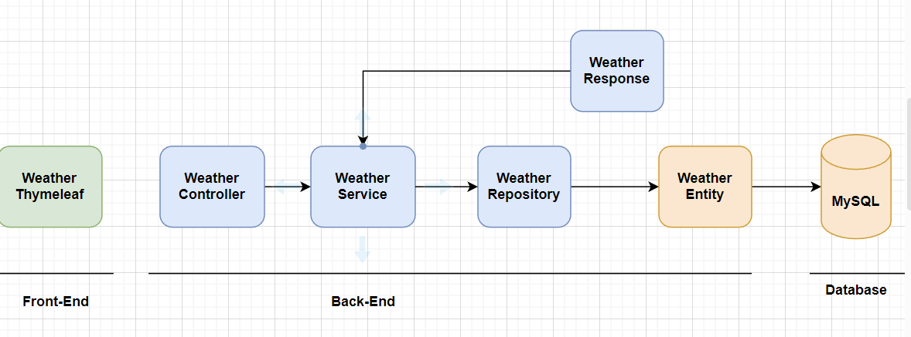

# Weather API

---
- Spring Boot
- Spring Security
- Thymeleaf
- Hibernate
- MySQL

---
## Project Requirements

---
1. Extracting a correct API structure.
2. Making validations on your model or parameters.
3. To make exception handling operations.

---
## Application Architecture

---
## Technologies Used:
1. Spring Boot 2.7.8
2. Spring Framework (Spring MVC and Spring Security)
3. Maven 4.0
4. Java 17
5. Spring Data Jpa (Hibernate)
6. Thymeleaf

---
## Steps:
1. Entity Class: First, create an Entity class that represents the weather data you want to store. It can have properties such as city, country, temperature, humidity, etc. This class will be mapped to a database table.
2. Response Class: The WeatherResponse class is used to store the data returned from the weather API
3. Repository Class: Next, create a Repository interface to manage the CRUD operations for the Entity class. The Repository will provide methods to save, update, delete, and retrieve the weather data from the database.
4. Service Class: After that, create a Service class to encapsulate the business logic for fetching weather information from the Free Weather APIs. This class will use the RestTemplate class to make API calls and process the response. The Service class will also implement the error handling and input validation.
5. Controller Class: Then, create a Controller class to handle incoming HTTP requests and send responses. The Controller class will use the Service class to fetch weather information and return the result to the user.
6. Thymeleaf HTML Document: Finally, create a Thymeleaf HTML document to display the weather information to the user. This document can have form fields for entering the city and country, and a submit button to initiate the API call.
7. Error handling: To handle errors, you can use try-catch blocks in the Service class to catch any exceptions that might occur during the API call. You can also use @Valid and BindingResult in the Controller class to validate the input and handle validation errors.
8. Input validation: To validate user input, you can use annotations such as @NotNull, @Size, @Min, and @Max in the Entity class. In the Controller class, you can use the BindingResult object to check for validation errors and return appropriate error messages to the user.

